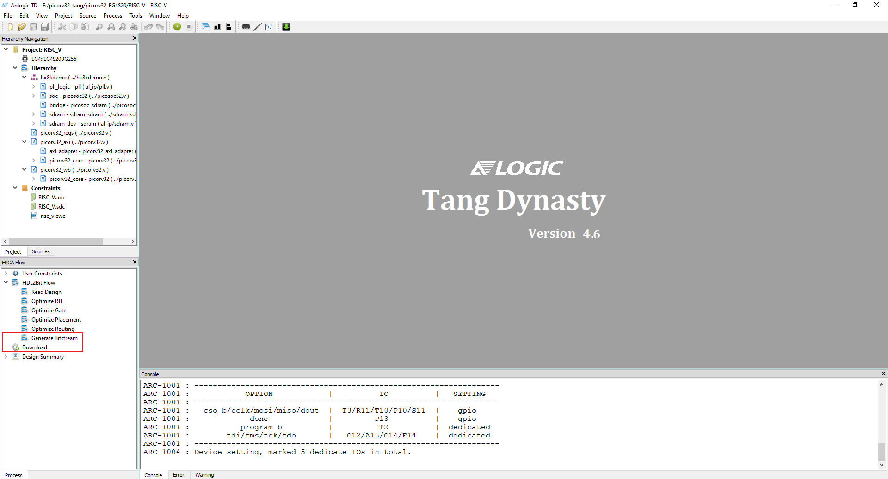

# Picorv32 + RT-Thread on Lichee Tang (EG4S20)

```
 \ | /
- RT -     Thread Operating System
 / | \     3.1.3 build Nov 25 2020
 2006 - 2019 Copyright by rt-thread team
Hello RT-Thread!
msh >
```

This repo aims to run RT-Thread (RTOS) on Picorv32 soft core (荔枝糖 EG4S20 FPGA).

[Picorv32](https://github.com/cliffordwolf/picorv32) is an open source RISC-V CPU core, and [RT-Thread](https://github.com/RT-Thread/rt-thread) is a burgeoning Real-Time Operating System (RTOS) in China that is small, stable and fast.


### Step 0 - Clone and initialize git submodules

This repo consists of two sub-repos. One is the FPGA soft core (picorv32), and the other is the firmware (RT-Thread).

```
$ git clone https://github.com/wuhanstudio/picorv32_tang
$ cd picorv32_tang
$ git submodule init
$ git submodule update
```

### Step 1 - Build RT-Thread firmware

First, let's build the RT-Thread operating system. The tool chain required for compilation is riscv32-unknown-elf-gcc. You may find this [tutorial](https://pingu98.wordpress.com/2019/04/08/how-to-build-your-own-cpu-from-scratch-inside-an-fpga/) helpful. 

```
$ cd rtthread-nano/rt-thread/bsp/picorv32_blink/
$ mkdir build & cd build
$ cmake ../
$ make
```

Now you should have rt-thread.bin.

### Step 2 - Generate Memory Initialization File (MIF) from rt-thread.bin

We use MIF to initialize ROM, so let's convert bin to mif.

```
# Copy generated rt-thread.bin out.
$ cp rtthread-nano/rt-thread/bsp/picorv32_blink/build/rt-thread.bin bin2mif/
$ cd bin2mif

# Generate MIF
$ python3 bin2mif.py rt-thread.bin rt-thread.mif
```
Then copy generated rt-thread.mif to FPGA project directory:

```
$ cp bin2mif/rt-thread.mif picorv32_EG4S20/firmware/
```
### Step 3 - Upload bitsream

Now, let's make things work on FPGA. The IDE can be downloaded [here](http://dl.sipeed.com/), and instructions on how to install it can be found [here](https://tang.sipeed.com/en/getting-started/installing-td-ide/linux/).

Click on **Generate Bitstream**, then choose **download** to flash the bitstream to your board. 



### Helpful Resources

- [Setting up the toolchain](https://pingu98.wordpress.com/2019/04/08/how-to-build-your-own-cpu-from-scratch-inside-an-fpga/)

### Related Projects
- [picorv32_EG4S20](https://gitee.com/Stupid_bird/picorv32_EG4S20)
- [rt-thread nano](https://github.com/flyfishR/rtthread-nano)
- [HBird E203 + RT-Thread](https://github.com/wuhanstudio/hbird_e203_tang)
